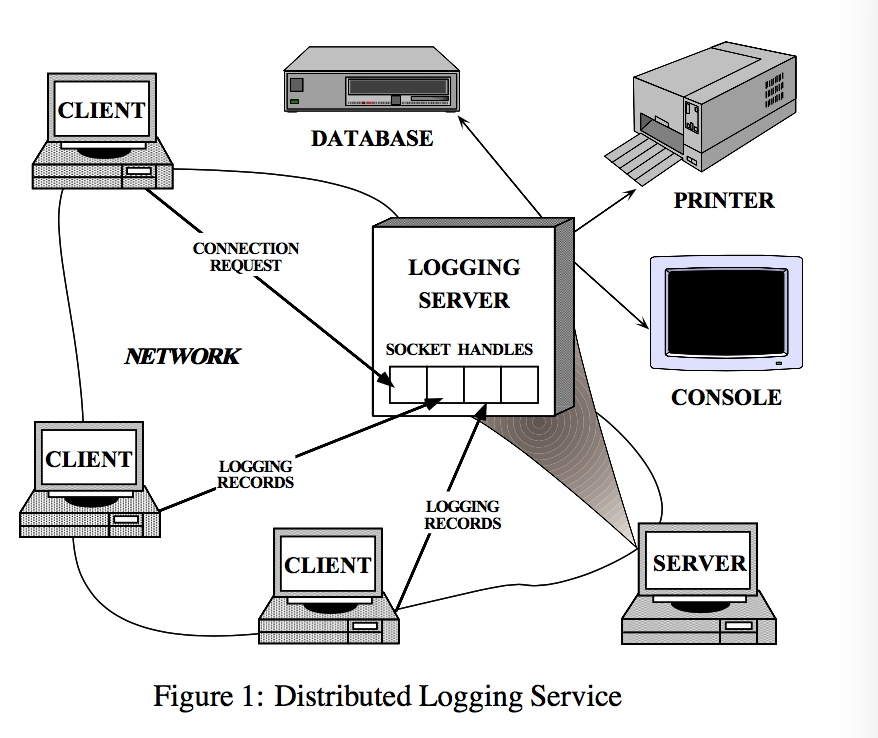
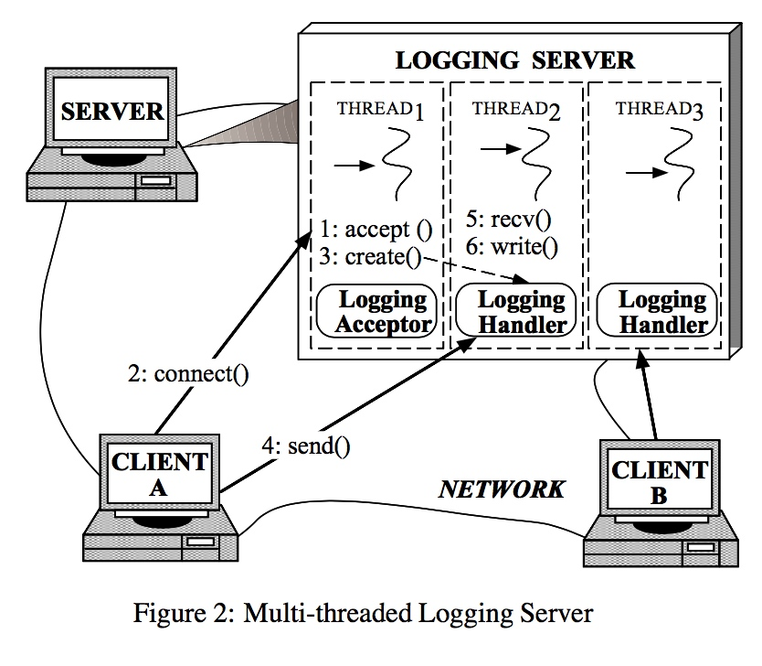
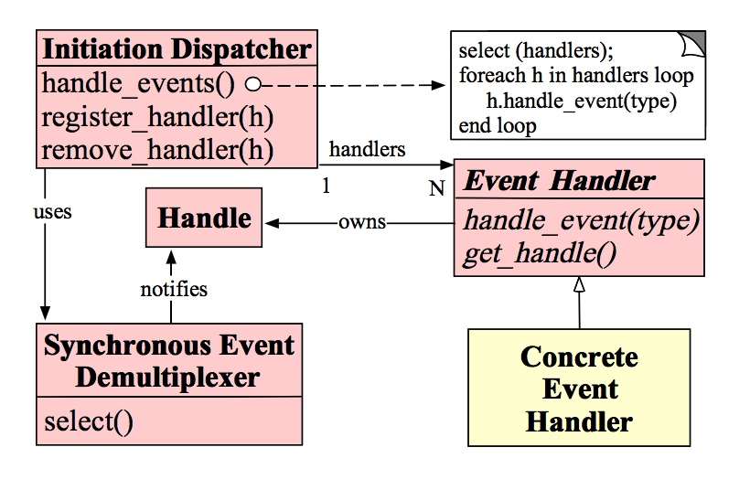
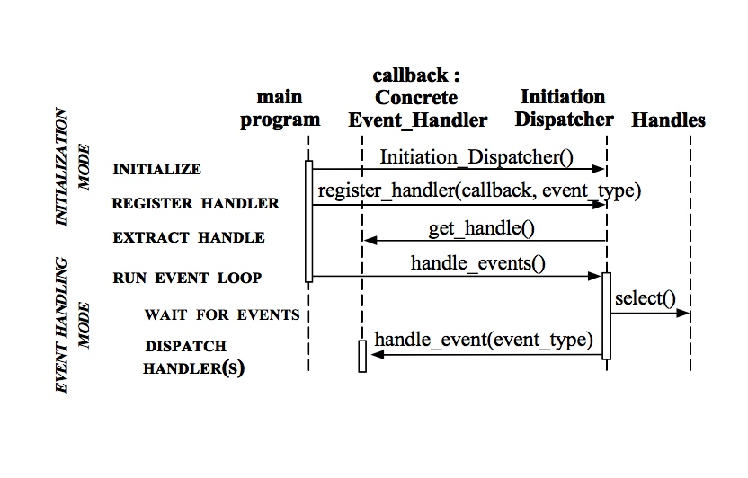
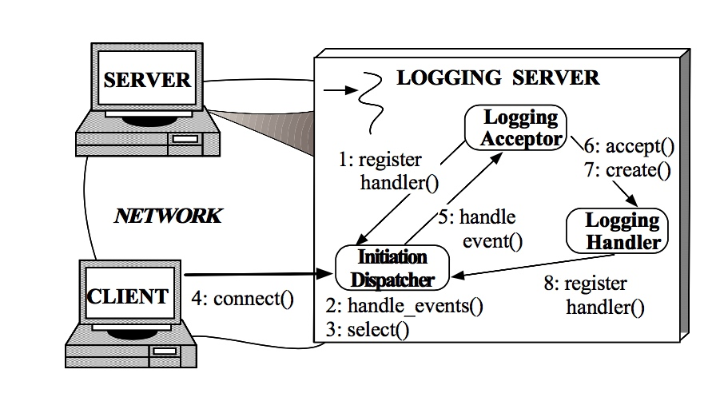
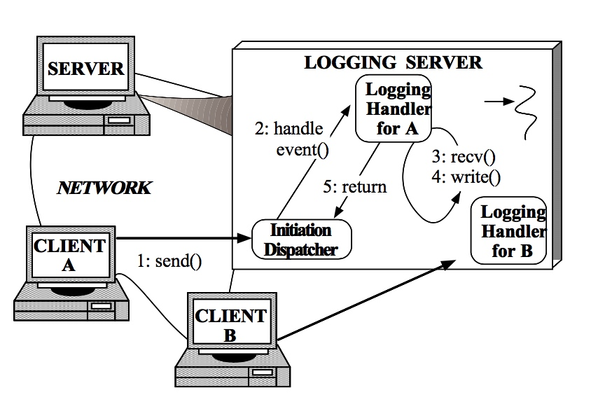
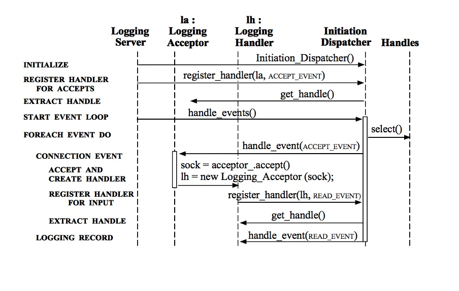

    
# 反应堆
用于同步事件的分离和调用句柄的对象行为模式
## 1 网络
反应堆设计模式处理那些由一个或多个并发传递到应用程序的请求服务。在应用中的每个服务可能由多种方法组成，并由一个负责调度具体的服务请求句柄表示。事件调度句柄由一个管理注册事件句柄的调度程序初始化。同步事件解复用程序处理复用的服务请求。
## 2 也被称为
Dispatcher，Notifier
## 3 样例


为了说明反应堆模式，考虑图1中展示的事件驱动的分布式日志服务程序。客户端使用日志服务来记录关于分布式环境中的状态信息。状态信息通常包括错误通知，bug跟踪和性能报告。错误记录被发送中央日志服务器，中央日志服务器将记录写入各种输出设备，如控制台，打字机，文件或者网络管理数据库。
正如图一所示，日志服务器处理来自客服端的日志记录和连接请求。因为有多个句柄，日志记录和连接请求能够同时到来。一个句柄识别操作系统中网络通信资源。
日志服务器使用面向连接的协议，例如TCP和客户端通信。客户端想要登记数据，必须首先向服务器发送连接请求。服务器使用句柄工厂（监听在一个告诉客户端地址的端口）等待这些连接请求。当一个连接请求到达时，句柄工厂建立一个新连接，并且通过创建一个新句柄代表连接端点。这个句柄返回给服务器，然后等待客户服务连接的到来。一旦客户端连接，他们能够同时向服务器端发送日志记录。服务器通过连接的socket句柄接受这些记录。

可能最直观的方法去开发一个分布式日志服务器是使用多线程，他们能够同时处理多个客户端，例如图2。这种方法同步的接受网络连接，然后产生一个“线程-连接”来处理客户端日志记录。
然而，使用多线程来实现在服务器中处理日志记录存在以下几个问题：

- 效率：由于上下文切换，同步和数据移动，线程可能导致性能不佳。
- 编程简单：线程可能需要复杂的并发控制方案。
- 可移植性：线程不是在所有平台都可以使用。

由于这些缺点，多线程往往不是开发并发日志记录服务器最有效或最不复杂的解决方案。

## 4 内容
分布式系统中的服务器应用程序，用于同时从一个或多个客户端接受事件。

## 5 问题
在分布式系统中，服务应用程序必须处理发送服务请求的多个客户端。在调用特定的服务之前，服务程序必须解复用并且派遣每一个到来的请求到相应的服务提供者。开发一个有效的服务器机制来解复用和调度客户端请求需要解决以下几个问题：

- 可用性：即使在等待其他的请求，这个服务器必须可以用来解决到来的请求。特别的，一个服务器不能无限期的阻塞任何单一的事件来排除其他事件来源，应为这个可能会显著的延迟对其他客户端的响应。
- 效率：一个服务器必须能够最小化延迟，最大化吞吐量并且避免没有理由的利用CPU
- 简单编程：服务器的设计应该简化使用并发策略的难度
- 适应性：集成新的或者改进服务像改变消息形式或者增加服务端缓存，应该对现有代码进行最小的修改，最低的维护成本。例如，实施新的应用程序服务不应该要求修改通用的事件解复用机制和调度机制。
- 可移植性：移植一个服务程序到另一个操作系统平台不需要特别费力。
## 6 解决方法
集成事件同步解复用和相应处理事件的句柄调度。换句话说，将应用特定的调度和服务实现从通用事件解复用和调度机制中解耦出来。
对每一个应用提供的服务，开启一个分离的事件句柄处理确定的事件类型。所有的事件句柄实现相同的接口。事件句柄向一个初始化调度员注册。初始化调度员使用同步事件解复用来等待事件触发。当事件触发时，同步事件解复用器通知初始化调度员，同时回调与事件关联的处理程序。事件句柄然后把事件分派到实现请求服务的方法。
## 7 结构
反应堆模式包括以下重要的参与者：

句柄：

- 标记被操作系统管理的资源。这些资源通常包括网络连接，打开文件，计时器，同步项目等等。句柄被用在日志服务器中标志接字端点，使得同步事件解复用能够监视他们来等待事件触发。在日志服务器中，有连接事件和读事件分别代表了客户端各自连接和日志数据。这个日志服务器对每个客户端维持一个单独连接。在服务器中，每个连接代表一个套接字句柄。

同步事件解复用：

- 一部分句柄处于阻塞等待。当句柄可以启动操作时返回。对于IO事件来说，一个普遍的解复用工具是Select。Select是一个UNIX和win32系统平台上的事件解复用系统函数。select函数说明句柄能够不阻塞应用进程对其进行调用。

初始化调度程序：

- 定义一个注册，移除，调度事件句柄的接口。最终，同步事件解复用器负责等待新事件的到来。当他发现新事件，他通知初始化调度程序回调特定应用程序的事件句柄。通用事件包括连接接受事件，数据输入，数据输出和超时事件。

事件句柄：

- 一个接口包括一个hook方法。hook方法抽象的表示特定服务事件的调度操作。这个方法必须由特定应用服务实现。

具体的事件处理器：

- 实现hook方法，以及以应用程序特定方式处理这些事件的方法。应用调用初始化调度员注册具体的事件处理器来处理特定的时间类型。当这些事件到达时，初始化掉队员回调合适的具体时间处理器的hook方法。
  
  在日志处理服务器中两个具体的事件处理器：日志处理事件和日志接受事件。日志处理事件用于接收和处理日志记录。日志接受事件源创造和连接日志处理事件源。
  


## 8 动态
### 8.1 普遍的合作
以下是在反应堆中的合作：

- 当一个应用程序用初始化调度员注册一个具体的事件处理器时，应用程序表明此事件的类型。该事件事件处理器接口希望，当事件在对应的标志符中触发时，初始化调度员将告知他。
- 初始化调度员请求每一个事件标志符传回其内部标志符。这句柄表示了系统中的该事件标志符。
- 当所有事件标志符都被注册,一个应用程序通知处理事件器来启动初始化调度员的事件循环。在这个时候，初始化调度员将句柄和注册标志符相结合，并使用同步事件分离器等待事件在这些标志符上触发。例如：TCP协议层使用select来等待来自相连的socket标志符的客户端日志记录事件。
- 当句柄相连的事件源变为ready，同步事件分离器通知初始化调度员，“那个TCP socket 已经准备好读取了”
- 党初始化调度员启动事件标志符的hook方法，当事件准备好时。当事件触发时，初始化调度员使用事件源激活的句柄作为键来定位和调度相应的事件处理程序hook方法。
- 初始化调度员回调该事件标志符的hook方法，来响应事件执行特定的功能。事件类型能够以参数传递给方法，并由该方法内部使用来执行额外的特定服务分离和调度功能。在9.4节将描述一个可替代的方法。

以下交互图说明了应用程序代码和参与者之间的协作模式：


### 8.2 合作情况

在日志服务器中，反应堆模式中的合作存在两种情况。这两种情况展示了使用反应事件调度设计的日志服务器如何处理连接请求和来自多个客户端的日志数据。

#### 8.2.1 客户端连接到反应日志服务器
第一种情况展示了当客户端连接到服务器的第一步


一系列的步骤总结如下：

- 1. 日志服务器使用初始化调度员注册日志接收器来处理连接请求。
- 2. 日志服务器唤起初始化调度员的事件处理方法。
- 3. 初始化调度员换气同步事件分离器Select操作来等待新的连接货这日志数据的到来。
- 4. 一个客户端连入日志服务器。
- 5. 日志接受接口被初始化调度员通知，因为有新的连接请求到来。
- 6. 日志接受接口接受新的连接。
- 7. 日志接受接口创建一个日志标志符来服务新的连接。
- 8. 日志标志符在初始化调度员中注册他的套接字句柄。然后，告诉调度员当套接字准备好时通知他。

#### 8.2.2 客户端发送日志记录给反应日志服务器

第二种情况展示了反应日志服务器接受日志记录的一系列步骤


- 1.客户端发送日志记录。
- 2.初始化调度员通知相关的日志标志符当一个新的日志记录在他的套接字句柄的栈中。
- 3.该记录以无阻塞的方式被接收（2，3步骤重复直到所有的记录都被接收）
- 4.日志处理者处理日志记录并且把他写到标准输出中。
- 5.日志处理程序把控制权返回给初始化调度员的事件循环。

## 9 实现
这一小结描述了如何使用C++来实现反应堆模式。下面的描述实现受ACE通信软件框架提供的可重用组件影响。

### 9.1 Select 同步事件分离机制
初始化调度员使用同步事件分离器来同步等待直到一个或多个事件触发。同步事件分离器通常由select实现。select指示哪些句柄准备好执行IO操作，而不会阻塞特定的应用服务处理程序所在的进程。通常，同步事件分离器基于现存的操作系统机制，无需开发。

### 9.2 反应器的开发
以下几步开发反应器非常重要：

**实现事件标志符表**：一个反应器维持一张关于具体的事件处理器的表。因此，反应器在运行时提供方法从这张表中注册和移除句柄。这张表能够以多种多样的方式实现，使用哈希，线性搜索或直接索引。

**实现事件循环入口**：反应器事件循环入口点应该被一个句柄事件方法提供。该方法控制由同步事件分离器提供的句柄分离，以及事件处理器调度。通常，整个应用程序的的事件循环被入口点所控制。

当事件触发时，反应器从同步事件分离器返回，并通过为每一个准备好的句柄分发处理事件钩子方法来“反应”。这钩子方法执行用户定义的代码，当执行完成时返回给反应器控制权。
    
下面的C++类说明反应器中公共接口的核心方法。

```C
enum Event_Type
// = TITLE
// Types of events handled by the 
// Initiation_Dispatcher.
//
// = DESCRIPTION
// These values are powers of two so
// their bits can be efficiently ‘‘or’d’’
// together to form composite values.
{
ACCEPT_EVENT = 01, READ_EVENT = 02, WRITE_EVENT = 04, TIMEOUT_EVENT = 010, SIGNAL_EVENT = 020, CLOSE_EVENT = 040
};
class Initiation_Dispatcher
// = TITLE
// Demultiplex and dispatch Event_Handlers
// in response to client requests.

{ 
public:
// Register an Event_Handler of a particular 
// Event_Type (e.g., READ_EVENT, ACCEPT_EVENT, 
// etc.).
int register_handler (Event_Handler *eh,Event_Type et);
// Remove an Event_Handler of a particular // Event_Type.
int remove_handler (Event_Handler *eh,Event_Type et);
// Entry point into the reactive event loop.
int handle_events (Time_Value *timeout = 0); 
};
```
**重要的同步机制实现**：如果反应堆模式被用在一个单线程应用程序中，则可以排除所有同
步。在这种情况中，反应器会在应用程序中序列化事件处理程序的句柄事件钩子。

然而，反应器也能在多线程应用中作为一个中心调度调度者。在这种情况下，反应器中的关键部分必须序列化，以便在修改或激活共享状态变量时防止出现竞争。防止竞争条件的常见技术有使用互斥机制例如信号量或锁。

为了防止个人死锁，互斥机制可以使用递归锁。递归锁可以防止死锁，因为锁被同一个线程反应器中事件处理钩子方法持有。一个递归锁被不断以无阻塞方式请求。这个属性非常重要，因为反应堆的句柄事件方法回调应用的特定事件处理程序。应用钩子方法可以通过反应器注册处理程序重新进入并删除处理程序方法。

### 9.3 确定调度目标的类型

两种不同类型的事件处理器可以与一个句柄关联，作为一个反应器的调度逻辑目标。反应堆模式实现可以选择以下一种或两种方案：

**事件处理对象**：一个普遍的方法把事件处理程序和句柄关联起来就是使事件处理程序成为对象。例如，第7节中所示的反应堆模式实现注册了一个反应器的事件处理程序子类对象。使用一个调度目标对象，使得子类事件处理程序更便利的使用和继承现存的组件。总的来说，对象把状态和服务的方法整合成了单一组件。

**事件处理函数**：另一个方法把事件处理程序和句柄关联起来就是用反应器注册一个函数。使用函数作为调取目标可以方便的注册回调，而无需定义一个继承事件处理器的类。

适配器模式能够同时支持对象和函数。例如，可以使用保存指向事件处理函数的指针的事件处理程序对象来定义适配器。当事件处理程序适配器对象调用句柄事件方法时，它可以自动将调用转发到它所拥有的事件处理函数。

### 9.4 定义事件处理接口
假定，我们使用事件处理对象而不是方法，下一步就是定义事件处理接口，下面是两种方法：

**一个单方法接口**：在第七小节中的OMT图展示了事件处理基类接口，该积累包括一个单一的方法叫做句柄方法，它被使用在反应器中去调度事件。在这个例子中，触发的事件类型被作为参数传入方法中。
接下来的C++抽象基类展示了这个单方法接口：

```C
class Event_Handler
// = TITLE
// Abstract base class that serves as the
// target of the Initiation_Dispatcher.
{ 
public:
// Hook method that is called back by the
// Initiation_Dispatcher to handle events. 
virtual int handle_event (Event_Type et) = 0;
// Hook method that returns the underlying // I/O Handle.
virtual Handle get_handle (void) const = 0;
};
```
单方法几口的优点是使得增加一个新的事件类型而不改变接口变的可能。然而，这个方法鼓励在子类的句柄事件方法中使用switch语句，这会限制其扩展性。

**一个多方法接口**：另一个方法实现事件处理程序接口是为每一种事件类型定义一个虚拟钩子方法，例如句柄输入，句柄输出，句柄超时。
接下来的C++抽象类展示了这个多方法接口：

```C
class Event_Handler
{
public:
// Hook methods that are called back by 
// the Initiation_Dispatcher to handle 
// particular types of events.
virtual int handle_accept (void) = 0; 
virtual int handle_input (void) = 0; 
virtual int handle_output (void) = 0; 
virtual int handle_timeout (void) = 0; 
virtual int handle_close (void) = 0;
// Hook method that returns the underlying 
// I/O Handle.
virtual Handle get_handle (void) const = 0;
};
```
多方法接口的好处在于，可以很容易的选择覆盖基类中的方法，并且避免进一步分离，例如通过在钩子方法中使用switch或着if语句。然而，这需要框架开发者首先预料到事件处理程序的集合。例如，上述的事件句柄接口中的各种句柄方法是针对UNIX选择机制提供的IO事件定制的。但是，接口不够宽泛，来包含所有通过WIN32 WaitForMultipleObjects 机制处理的事件。

以上两种方法是钩子方法模式和工厂回调模式。这些模式的意图是提供良好定义的钩子方法，该方法能被较低级代码良好调用。

### 9.5 确定应用中反应器的数量
很多应用能够被设计为只使用一个反应堆模式的实例。在这个例子中，反应器被实现为单个物件。这个设计对集中式事件分离和在应用内单一调度很有效。
然而，一些操作系统限制了单个控制线程可以等待的句柄数量。例如，单一线程中，WIN32允许select和WaitForMultipleObjects等待不超过64个句柄。这种情况下，多线程就变得十分重要。每一个线程运行它独立的反应堆模式实例。

注意，事件处理程序只在一个反应堆模式中被序列化。因此，多事件处理程序能够在多线程中平行的运行。这种配置下，如果事件处理程序在不同的线程中访问共享的区域，可能使得额外的同步机制会变的十分重要。

### 9.6 具体的事件处理器的实现
具体的事件处理器一贯由应用开发者编写，它们被用来以特定的服务回复特定的事件。开发者必须查明什么进程该执行当相关的钩子方法被反应器唤起。
接下来的代码展示了第三小节中的日志服务器的具体事件处理器。这些处理程序提供了被动的连接连接（日志接受器）和数据接收（日志处理器）。

**日志接受类**：这个类是接受器-连接器模式中的接受器示例。接收器-连接器模式将服务初始化任务与服务初始化后执行的任务分离。此模式使服务的应用程序特定部分（如日志处理程序）能够独立于所使用的机制进行变化。
一个日志接受器被动的接受来自客户端的连接，并创建特定的日志处理程序对象。日志处理对象那个接受和处理来自客户端的日志记录。最关键的方法和数据成员定义如下：
```C
class Logging_Acceptor : public Event_Handler // = TITLE
// Handles client connection requests.
{ public:
// Initialize the acceptor_ endpoint and
// register with the Initiation Dispatcher. 
Logging_Acceptor (const INET_Addr &addr);
// Factory method that accepts a new
// SOCK_Stream connection and creates a
// Logging_Handler object to handle logging 
// records sent using the connection. 
virtual void handle_event (Event_Type et);
// Get the I/O Handle (called by the 
// Initiation Dispatcher when
// Logging_Acceptor is registered). 
virtual HANDLE get_handle (void) const {
return acceptor_.get_handle (); }
private:
// Socket factory that accepts client // connections.
SOCK_Acceptor acceptor_;
};
```
日志接受器继承事件处理程序。应用程序使用反应器注册日志接受器。
日志接受器也包含一个SOCK接受器实例。这个具体工厂使得日志接受器在侦听通信端口的套接字上被动的接受连接请求。当一个连接到达时，SOCK接受器接受连接，并且产生一个sock流类。之后，sock流对象被可靠的用来在客户端和日志服务器中传输数据。
用于实现日志记录服务器的SOCK接受器和SOCK流类是ACE提供的C++套接字包装库的一部分。这些套接字包装器将套接字接口的SOCK Stream语义封装在便携式和安全的面向对象接口中。 在Internet域中，使用TCP实现SOCK Stream套接字。
日志接受器的构造函数为ACCEPT事件注册了反应器组件，如下所示：

```C
Logging_Acceptor::Logging_Acceptor (const INET_Addr &addr)
    : acceptor_ (addr)
{
// Register acceptor with the Initiation
// Dispatcher, which "double dispatches"
// the Logging_Acceptor::get_handle() method 
// to obtain the HANDLE. 
Initiation_Dispatcher::instance ()->register_handler (this, ACCEPT_EVENT);
```
从此以后，当一个连接到达时，反应器会掉日志接受器的句柄事件方法。如下所示：

```C
void
Logging_Acceptor::handle_event (Event_Type et) {
// Can only be called for an ACCEPT event. 
assert (et == ACCEPT_EVENT);
  SOCK_Stream new_connection;
// Accept the connection. 
acceptor_.accept (new_connection);
// Create a new Logging Handler. Logging_Handler *handler =
new Logging_Handler (new_connection); }
```
句柄事件方法唤起SOCK接受器的接受方法，然后被动的创建一个SOCK流。一旦SOCK流被新的客户端连接，一个日志处理程序呗动态的分配去处理日志请求。如下所示，日志处理程序在反应器中注册自己，它将分离所有关联客户端的日志记录。

**日志处理程序类** ： 日志服务器使用如下所有展示的日志处理程序类来接受客户端的日志记录。

```C
class Logging_Handler : public Event_Handler 
// = TITLE
// Receive and process logging records
// sent by a client application.
{ public:
// Initialize the client stream. 
Logging_Handler (SOCK_Stream &cs);
// Hook method that handles the reception 
// of logging records from clients. 
virtual void handle_event (Event_Type et);
// Get the I/O Handle (called by the 
// Initiation Dispatcher when
// Logging_Handler is registered). 
virtual HANDLE get_handle (void) const {
return peer_stream_.get_handle ();
private:
// Receives logging records from a client. 
SOCK_Stream peer_stream_;
};
```

日志处理程序继承事件处理程序，使得日志处理程序用反应器注册，如下所示：

```C
Logging_Handler::Logging_Handler (SOCK_Stream &cs)
    : peer_stream_ (cs)
{
// Register with the dispatcher for 
// READ events. 
Initiation_Dispatcher::instance ()->register_handler (this, READ_EVENT); 
}
```

一旦被创建，日志处理程序使用反应器注册READ事件。从此之后，当一个日志记录到达时，反应器自动的关联的句柄事件方法。如下所示：

```C
void
Logging_Handler::handle_event (Event_Type et) 
{
if (et == READ_EVENT) {
Log_Record log_record;
peer_stream_.recv ((void *) log_record, sizeof log_record);
// Write logging record to standard output.
log_record.write (STDOUT); 
}
else if (et == CLOSE_EVENT) { 
peer_stream_.close (); 
delete (void *) this;
    } 
}
```
当一个读事件在套接字句柄上触发时，反应器回调日志处理器的句柄事件方法。这个方法接受，处理和把日志记录写到标准输出。同样的，当客户端关闭连接时，反应器传递一个关闭事件通知日志处理器关闭这个sock流并删除它。

### 9.7 服务器实现
日志服务器包含单main函数。

**日志服务器main函数**：这个方法实现了单线程并发进程，它在反应器的句柄事件中等待。当来自客户端的请求到来时，反应器唤起具体的事件处理器钩子方法。该方法接受连接，接收和处理日志记录。这个在日志服务器中主要的入口定义如下：

```C
// Server port number. 
const u_short PORT = 10000;
int
main (void)
{
// Logging server port number. 
INET_Addr server_addr (PORT);
// Initialize logging server endpoint and 
// register with the Initiation_Dispatcher. 
Logging_Acceptor la (server_addr);
// Main event loop that handles client
// logging records and connection requests. 
for (;;)
Initiation_Dispatcher::instance ()-> handle_events ();
/* NOTREACHED */
return 0; }
```

这个主要的程序创建了一个日志接受器。主程序用端口号初始化该接受器。然后，程序进入主循环。随后，反应器组件使用select事件分离系统等待来自客户端的连接请求和日志记录。
接下来的交互图说明了参与日志服务器示例的对象协作：


一旦反应器对象被初始化，它就成为了在日志服务器中流控的焦点。所有之后的活动都是被日志接受器和日志处理程序对象启动和注册的，然后被反应器控制。
当一个连接请求到达网络连接时，反应器回调日志接受器。日志接受器接受网络连接，创建一个日志处理程序。该日志处理程序向反应堆注册read事件。因此，当一个客户端发送日志记录，反应器回调客户端的日志处理程序，日志处理程序在日志服务器的单线程控制下去处理到来的日志记录。

## 10 已知用法
反应堆模式被用在很多面向对象框架，包括以下：

InterViews：反应器模式由InterViews窗口系统分布实现，它被称为调度程序。 InterViews Dispatcher用于定义应用程序的主事件循环，并管理与一个或多个物理GUI显示器的连接。

ACE 框架：ACE框架使用反应堆模式作为中心事件分离器和调度器。

反应堆模式也被用在很多普遍的项目下，包括：

- CORBA ORBs： CORBA（例如VisiBrocer，Orbix和TAO）的许多单线程实现中的ORB Core层使用Reactor模式将ORB请求分离并分配给下属。
- 爱立信EOS呼叫中心管理系统：该系统使用反应器模式来管理呼叫中心管理系统中PBX和主管之间的事件服务器路由的事件。
- 项目频谱：项目Spectrum的高速医学图像传输子系统使用反应堆模式进行医学成像系统。

## 11 总结
### 11.1 优点
反应堆模式提供以下优点：

- 关注分离：反应堆模式从应用程序特定的钩子方法功能中解除了与应用无关的分离和调度机制。 应用程序无关机制是可重用的组件，它们知道如何分离事件并分派由事件处理程序定义的适当的钩子方法。 相比之下，钩子方法中的应用程序特定功能知道如何执行特定类型的服务。
- 提高事件驱动应用程序的模块化，可重用性和可配置性：该模式分解应用程序功能成单独的类。例如，在日志服务器中有两种分离的类：一种针对建立的连接，另一种针对接受和处理日志记录。这种去耦使得针对不同类型的面向连接的服务（如文件传输，远程登录和视频点播）重新使用连接建立类。因此，修改或扩展日志记录服务器的功能只会影响日志记录处理程序类的实现。
- 提高应用可移植性：反应器接口能够独立于操作系统执行事件分离操作。这些系统函数检测并报告可能在多个事件源同时触发的一个或多个事件。普遍的事件源可能包括I/O处理，时间和同步对象。在UNIX平台，事件分离系统函数被称为select和poll。在WIN32 API，WaitForMultipleObjects 用来事件分离。
- 提供粗粒度并发控制：在事件分离和调度层面，反应堆模式将事件处理程序调度序列化。在反应器层面，序列化通常不需要在应用程序进程中进行更复杂的同步或锁定。
### 11.2 缺点
反应堆模式存在以下几点缺点：
适用性受限制：反应堆模式只能够被部署在支持句柄的操作系统上。在反应器中能够用多线程模仿出反应堆模式。一个事件开辟一个线程。无论何时有事件可用在句柄上，它关联的线程会读该事件，并把它放置于一个栈，由反应器顺序的处理。
然而这种设计典型效率低，因为序列化所有事件处理程序，从而增加同步和上下文切换开销，而不增加并行性。
非抢先：在单一线程应用程序中，事件处理程序为非抢占式。这个暗示一个事件处理程序不应该在单独的句柄上阻塞，因为这个会阻塞整个进程，阻塞里客户端连接到其他的句柄。因此，对于诸如传输多兆字节医疗图像等长时间操作，活动对象模式可能更有效。一个有效的对象使用多线程或多进程以及反应器来平行的完成其任务。

难以debug：以反应堆模式写的应用很难debug，因为控制的反向流在框架基础架构和应用程序特定处理程序的方法回调之间振荡。这个增加了在调试器中单步调试框架运行行为的难度，因为应用开发者可能不能理解或者没有权限看到框架代码。这个有点类似于调试一个使用LEX进行词法分析YACC进行语法分析的编译程序一样复杂。在这些应用中，当控制线程在用户定义的行为内，调试很简单。一旦，控制线程返回到生成确定有限自动机的DFA架构中，很难遵循程序的逻辑。

## 12 也看看
反应堆模式和观察者模式相互关联，当一个独立对象改变时，所有的依赖被通知。在反应堆模式中，当处理程序感兴趣的事件发生在事件源上时，通知单个处理程序。反应堆模式通常将来自多个源的事件分离到其关联的事件处理程序，而观察者通常仅与单个事件源相关联。

反应堆模式与责任链（CoR）模式有关，其中请求被发送到负责的服务提供商。反应堆模式和COR模式不同的地方是，反应堆模式将特定事件处理程序和特定的时间源关联，而COR模式搜索链表来定位第一个匹配的事件处理程序。

反应堆模式可以被认为是异步Proactor模式的同步变种。Proactor支持由异步事件完成触发的多个事件处理程序的分离和调度。相比之下，当可以同时启动操作而不触发阻塞时，反应器模式负责分离和分派多个事件处理程序。

活动对象模式将方法执行与方法调用分离，通过控制不同线程中调用方法来简化对共享资源的同步访问。当线程不可用或线程的开销和复杂性是不希望的时，反常模式通常用于代替活动对象模式。

反应堆模式的实现为事件分解提供了一个立面。Facade是一个接口，可以将应用程序屏蔽在子系统内的复杂对象关系中。


